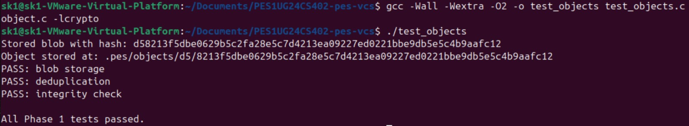
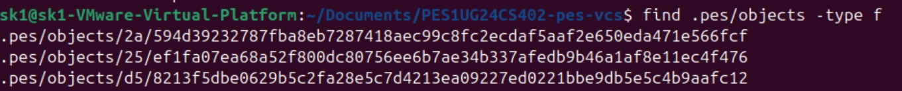
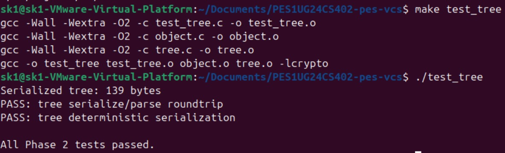
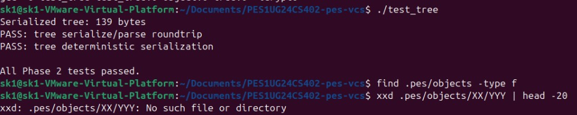
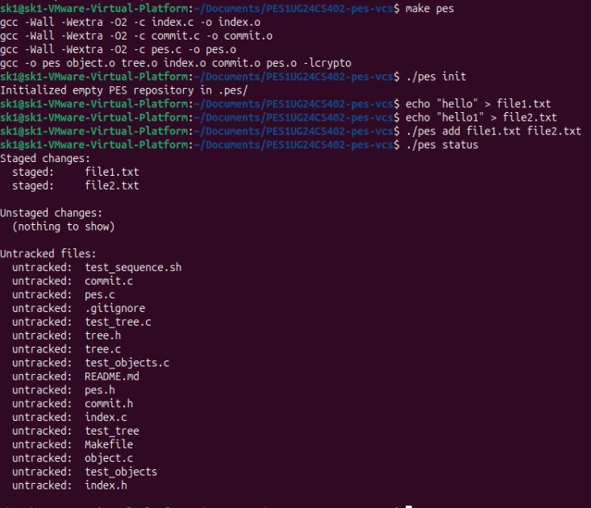
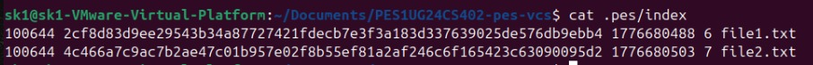
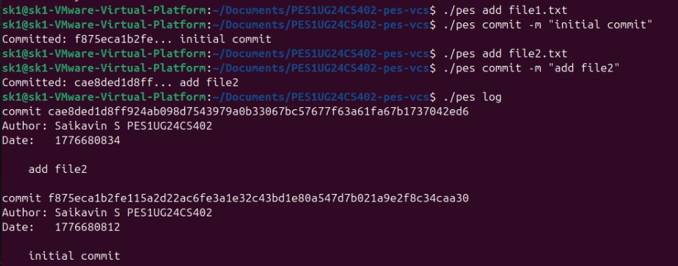
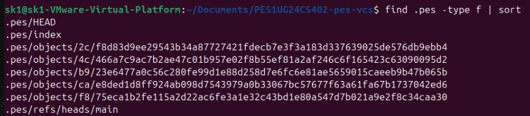
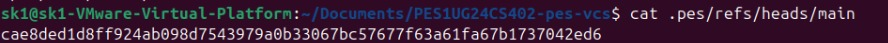
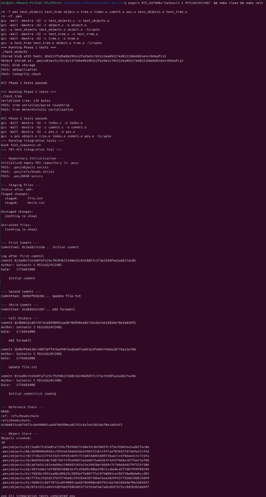

# Building PES-VCS — A Version Control System from Scratch

## Student Details
- Name: Saikavin S
- SRN: PES1UG24CS402
- GitHub Repository: https://github.com/Saikavin-S/PES1UG24CS402-pes-vcs

## **NOTE:** I did not see `5 commits per phase` but did a commit for each phase. 

This repository contains a working implementation of PES-VCS, a small local version control system built in C. It stores file contents as hashed objects, builds trees from staged files, records commit history, and updates branch references through a HEAD pointer.


## What Changed

The implementation is split across four core source files:

- `object.c`: stores and reads content-addressed objects with integrity checks
- `tree.c`: builds tree objects from the staged index
- `index.c`: loads, saves, and updates the staging area
- `commit.c`: creates commits and updates repository history

The result follows a simplified Git workflow:

1. `pes add` stores file data in the object database and updates the index.
2. `pes commit` builds a tree from the index and writes a commit object.
3. `pes log` walks the commit chain through the branch reference.
## Build And Test

```bash
make
make test_objects
make test_tree
make test-integration
```

The implementation was verified with the object tests, tree tests, and the full integration sequence.

### Screenshots

| Phase | ID  | What to Capture                                                 |
| ----- | --- | --------------------------------------------------------------- |
| 1     | 1A  | `./test_objects` output showing all tests passing               |
| 1     | 1B  | `find .pes/objects -type f` showing sharded directory structure |
| 2     | 2A  | `./test_tree` output showing all tests passing                  |
| 2     | 2B  | `xxd` of a raw tree object (first 20 lines)                    |
| 3     | 3A  | `pes init` → `pes add` → `pes status` sequence                 |
| 3     | 3B  | `cat .pes/index` showing the text-format index                  |
| 4     | 4A  | `pes log` output with three commits                            |
| 4     | 4B  | `find .pes -type f \| sort` showing object growth              |
| 4     | 4C  | `cat .pes/refs/heads/main` and `cat .pes/HEAD`                 |
| Final | --  | Full integration test (`make test-integration`)                 |
## Screenshots

### Phase 1





### Phase 2





### Phase 3





### Phase 4







### Final



## Analysis Answers
##### **Q5.1:** A branch in Git is just a file in `.git/refs/heads/` containing a commit hash. Creating a branch is creating a file. Given this, how would you implement `pes checkout <branch>` — what files need to change in `.pes/`, and what must happen to the working directory? What makes this operation complex?

To implement pes checkout <branch>, these updates are needed:

Validate that .pes/refs/heads/<branch> exists.
Update .pes/HEAD to point to that branch reference.
Read the target commit hash from .pes/refs/heads/<branch>.
Load the target commit tree and rewrite the working directory to match it.
Update .pes/index to match the checked-out tree.

The hard part is the working directory update. Files can be added, removed, modified, or conflict with local edits. The command must avoid destroying uncommitted work.

##### **Q5.2:** When switching branches, the working directory must be updated to match the target branch's tree. If the user has uncommitted changes to a tracked file, and that file differs between branches, checkout must refuse. Describe how you would detect this "dirty working directory" conflict using only the index and the object store.
A safe check can be done in three comparisons:

Compare current working files with .pes/index using metadata, and re-hash only when mtime or size differs.
Compare current branch tree with target branch tree to find paths that differ between branches.
If any path is both locally modified and different in the target branch, abort checkout.

This blocks destructive overwrites and keeps behavior consistent with Git-like safety rules.

##### **Q5.3:** "Detached HEAD" means HEAD contains a commit hash directly instead of a branch reference. What happens if you make commits in this state? How could a user recover those commits?

Detached HEAD means HEAD points directly to a commit hash, not a branch file. New commits still chain correctly through parent pointers, but they are not attached to any named branch. If the user switches away, those commits become unreferenced and are at risk of being collected by GC.
Recovery options:

Create a new branch pointing at that commit hash.
Move an existing branch ref to that commit hash.

As long as the hash is still known from the log or an object walk, the full commit chain can be preserved.

##### **Q6.1:** Over time, the object store accumulates unreachable objects — blobs, trees, or commits that no branch points to (directly or transitively). Describe an algorithm to find and delete these objects. What data structure would you use to track "reachable" hashes efficiently? For a repository with 100,000 commits and 50 branches, estimate how many objects you'd need to visit.
A mark-and-sweep approach works:

Start from all branch heads in .pes/refs/heads.
Walk each reachable commit through its parent chain.
For each commit, mark its tree and parent commit.
For each tree, recursively mark all child trees and blobs.
After marking, scan .pes/objects and delete everything unmarked.

Use a hash set for marked object IDs to get O(1) membership checks and avoid revisiting shared objects.
For 100,000 commits and 50 branches, the traversal covers roughly 100,000 unique commits in a shared history, plus all reachable trees and blobs. The exact total depends on file churn, but visited object count can easily be several times the commit count.

##### **Q6.2:** Why is it dangerous to run garbage collection concurrently with a commit operation? Describe a race condition where GC could delete an object that a concurrent commit is about to reference. How does Git's real GC avoid this?
GC is unsafe during an active commit without coordination. The race goes like this:

Commit writes new blob and tree objects to the store first.
Before the branch ref is updated, GC scans refs and does not see those new objects as reachable.
GC deletes them.
Commit then finalizes a commit object that references now-missing data.

Git avoids this using lock files, atomic ref updates, and conservative GC rules that skip recently created loose objects regardless of reachability. Write operations and GC are coordinated so no object is collected in the gap between creation and ref publication.
